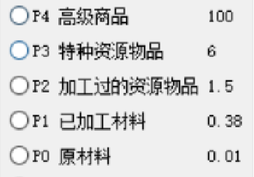
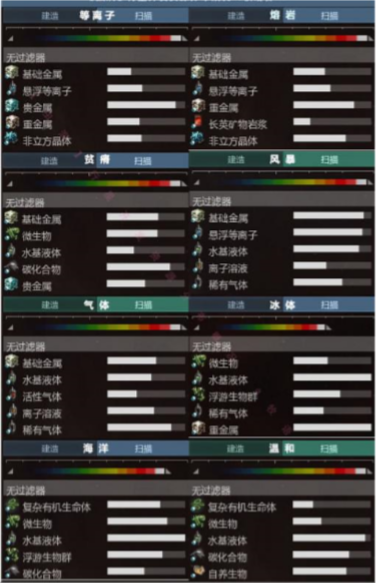
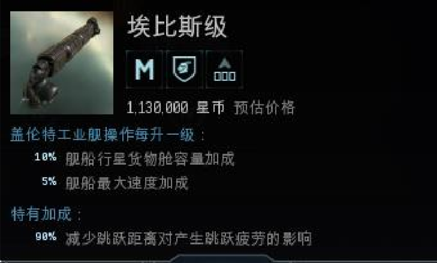
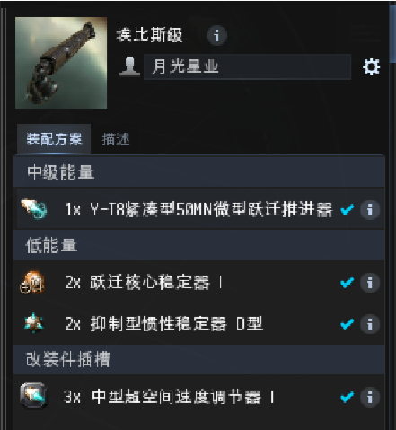
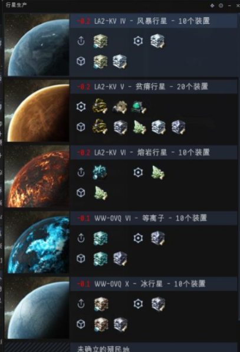
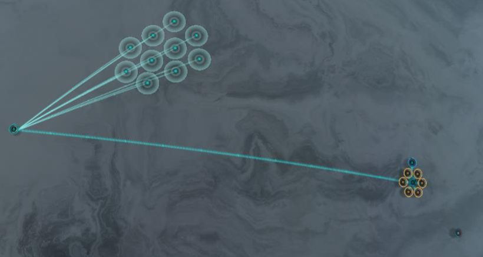
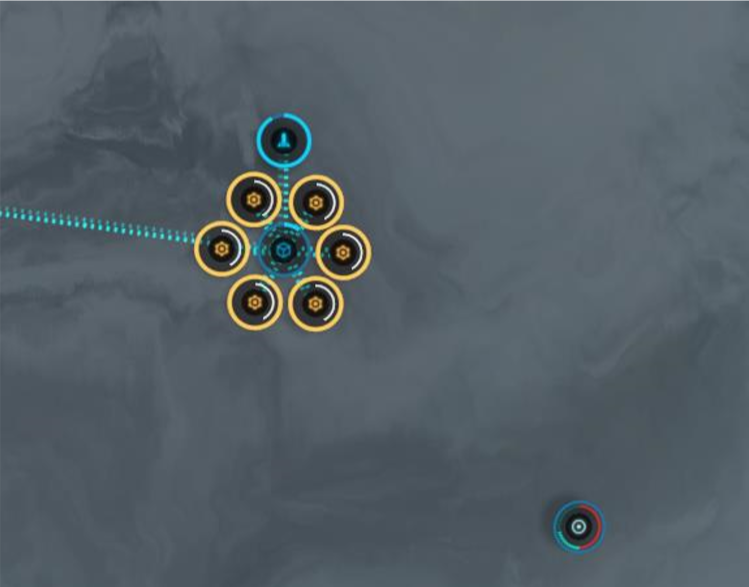
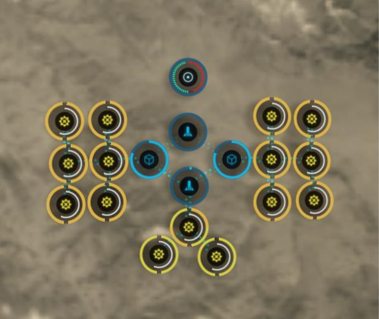
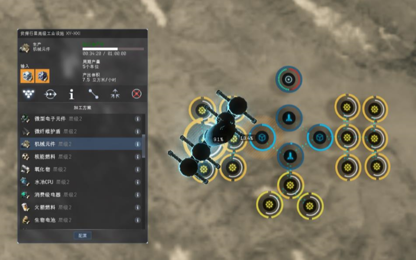
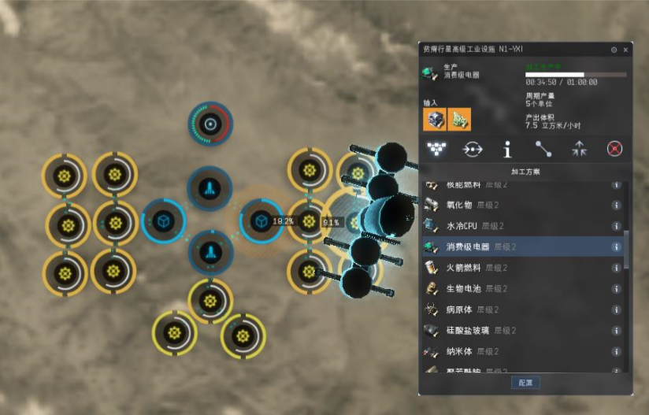

# 行星开发入门

> by CS Castiel-moon/月光

## 前言

本教程主要是支撑军团工业发展和建筑维护消耗，帮助军团成员快速形成产出， 不代表最优产出方案。该教程方案下一个角色能独立每天产出 200-300 个 p3、 或两种 p2 各 1000 个，上手和维护较为简单，能快速形成生产力

## 1.基础知识

### 1.1什么是行星开发？

EVE 中的行星开发俗称“种菜”，主要是指在星系行星上建造指挥中心和相 关建筑，进行资源开采和多次加工的过程。因为整个采集加工过程均为持续、自 动运行，只需要每隔一段时间（一般为一天）进行重新配置，十分类似种菜模式 而得名。

### 1.2行星开发产物有哪些？在哪里开采？

行星产物按照加工等级由低到高分为五个等级，一般简称 P0/P1/P2/P3/P4。 其中 p0 原材料可通过采集直接获取，而 p0 以上产物则都是由低级产物合成加工 得到。因为 p0 产物体积巨大且每种 p0 只能对应加工形成一种 p1，故其采集时 一般就同时加工成 p1，游戏中常看到的也都是 p1 及以上产物



EVE 中一共有 8 种不同行星球类型，每个星球产出五种不同 P0，且产出类 型和产量各不相同，其对应产出和产量如右下图。



### 1.3 行星产物主要用来做什么？

行星产物是高级工业的基础，不同产物的主要用途如下：

| 等级 | 用途 |
| :--- | :--- |
| P0 | 全部用于合成 P1 |
| P1 | 少量用于制造燃料块（如氧）、主要用于合成 P2 |
| P2 | 少量用于 T2 制造、大部分用于制造燃料块（如冷却剂、核能燃料、 机械元件）、部分用于合成 P2 |
| P3 | 主要用于 T2 制造，部分用于制造燃料块\(如机器人技术\)，少量用于 合成 P4 |
| P4 | 全部用于制造堡垒建筑 |

### 1.4行星开发需要什么技能准备和成本投入？

按照本教程种菜方案需要的技能要求如下，大概需要 5 天时间。这里主要需 要 5 个星球种菜（4 个产 p1，一个加工 p3），前期技能不够可以先全部学到 3， 用 4 个星球产 p1，等积累一定 p1 材料后，再开始加工产出 p3。


每个行星进行开采前需要配置相关建筑方案。首先，需要安装对应星球类型 的`指挥中心`，`指挥中心`可以在吉他 NPC 直接购买，很便宜，**大概 1m 一个**。有了 指挥中心就可以开始建造采集器、仓库、加工厂等建筑，会收取一定费用**一个球 大概花 1-2m**。

完成建筑配置后，就可以设置开采位置和时间进行开采，全过程自动且免费。 等开采结束就可以飞海关回收开采的产物。这里从海关中拿出和放入产物时会根 据产物估价收取海关税，我们驻地海关都是 0 税，所以不用给钱啦，**免费种，种 了都是自己的。**

另外就是运菜需要一条专门的工业舰，配下来大概 **2m。**





## 2.开采方案

**配置思路是“4+1“”模式，即 4 个球产出 p1，1 个球加工 p3。**

这里以我在军团驻地加工 p3 机器人技术为例进行说明，新人也可以直接按 照我的方案进行配置产出。

机器人技术的加工路线和星球选择：




### 2.1 开采星球的建筑配置方案

开采星球比较简单，主要就是开采 p0 并直接加工成 p1。 以第一个风暴球为例，其他同理。具体建筑方案为： 

```text
1 指挥中心 
1 仓库 
1 海关发射平台 
1 采集控制器 
6 基础工业设施
```





注意**建筑位置要选在产量丰富的地方，加工设施紧围着仓库以节约传送带 长度。采集器可根据产量图每次重新调整位置**。产物加工传送路线为：采集器 p0&gt;&gt; 仓库&gt;&gt;加工厂&gt;&gt;海关。海关 p1 满后收取即可。**建议采集器开采周期为 28 小时 （即一天配置一次）。**

### 2.2 加工星球的建筑配置方案

这里给出直接从 p1 加工 p3 的法案，也可以分别产出 2 种 p2。 同样以加工机器人为例，具体建筑为：

```text
1 指挥中心
2 仓库（一个存放反应金属和稀有金属，一个存放手性结构和有毒金属）
2 个海关发射平台
15 个高级工业设施（6 个产机械元件、6 个产消费级电器、3 个产机器人技术） 
```








具体加工运作流程为： 

1.  在海关 1 放入 13000 个反应金属和稀有金属，在海关 2 放入 13000 个手性结 构和有毒金属。
2. 将两个海关中的 p1 分别快速传输到两个仓库中，在两边的工厂进行机械原 件和消费级电器的生产。
3. 将产出的 p2 直接传输到下方 3 个工厂进行机器人技术生产。
4. 产出的 p3 输送到其中一个海关存放。
5. 等仓库中的 p1 消耗完，飞海关重新放入新的 p1，并取出产出的 p3。


## 3.推荐产物加工合成流程图

### 3.1 P3机器人技术（t2武器、无人机制造、燃料块制造）


### 3.2 P3制导系统（t2无人机制造）


### 3.3 P2冷却剂（燃料块制造）


### 3.4 P2核能燃料（燃料块制造）


### 3.5 P2机械元件（燃料块制造）


### 3.5 p1氧（燃料块制造）


## 科普

燃料块主要用于维持堡垒建筑的各项服务和正常运作，如工业制造、精炼、堡垒 防御、月矿牵引、跳桥等，消耗十分巨大也是军团和联盟维护的主要开支。以氮 染料块为例，其制造所需材料如下，推荐成员优先产出，军团回收:


