# 无人机刷怪

## 配置

**军团首页**可查看各类刷怪配置

> 以下配置即教程为欧莎无人机怪为主，可以根据自身需求调整
>
> 以下数据均以军团配置为准

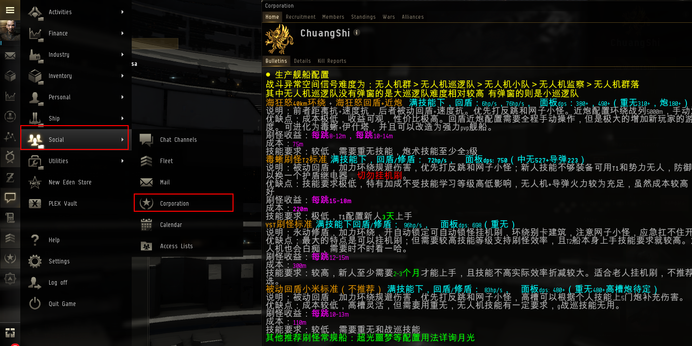

欧莎为**无人机怪** 防御弱**电伤**，因此用艾玛无人机，攻击为**全伤**，因此使用全抗

### 毒蜥（Gila）

伤害类型：

**电伤中型无人机 + 热伤轻快导** = 750 DPS （530 + 220）

抗性：

**速度抗** + **有效抗**= 635m/s + 50.1k EHP

优点：技能需求低、收益高、盾量大，遇到**超高伤害**攻击（小航怪、敌对）不会暴毙，后期导弹升为重攻导伤害更高

缺点：贵（相对于新人）、受持续伤害能力差、**技能与伊什塔重复度低**，升至伊什塔有一定难度

### 伊什塔（YST）（挂机）

伤害类型：

**电伤重型无人机** = 700 DPS

抗性：

**速度抗** + **修盾** = 574m/s + 16.8 + 272.2EHP/s（突击损控：52.6k EHP + 1007.3EHP/s）

优点：便宜（相对于老人）、收益高、万金油，几乎所有 pve 都能做、受持续伤害能力高、可装配突击损控以应对突发事件,**可挂机**

缺点：技能需求高、**突击损控进入 CD or 无突击损控时**，遇到**超高伤害**攻击可能暴毙

### 狂怒（阿尔法新人使用）

伤害类型：

**电伤重型无人机** = 400 DPS

抗性：

**速度抗** + **回盾** = 600m/s + 100EHP/s

优点：便宜（相对于新人），技能需求低

缺点：收益低

### 实践

伤害类型：

**电伤岗哨无人机** + **热伤巡航导弹** = 950DPS（550 + 400）

抗性：

**距离抗** + **修盾** = 75KM + 160EHP/s（手动控制盾量）

优点：便宜，技能要求较低，输出较高

缺点：起跳较慢

### 响尾蛇（常规天花板）

伤害类型：

**电伤岗哨无人机** + **热伤巡航导弹** = 1150DPS（550 + 600）

抗性：

**距离抗** + **修盾** = 100KM + 180EHP/s（手动控制盾量）

优点：盾量高、伤害高

缺点：起跳较慢、贵

## 规划

{& page-ref page="../produce/planning.md" &}

## 无人机

> 以下无人机技能以重无举例，其他同理

常用无人机为三种：帝国海军无人机（势力）、T2 无人机、加强型无人机（势力）

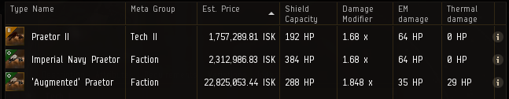

- 势力无人机**血量及转速均比 T2 无人机高** ，但**价格均比 T2 高**
- 帝国海军无人机伤害与 T2 相同且只需相应`无人机操控理论`一级，但不受`帝国无人机专业研究`技能加成

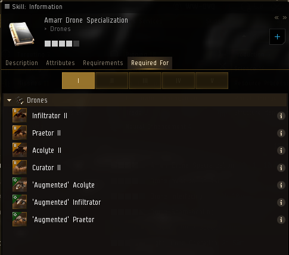

- 加强型无人机**面板 DPS**比 T2 无人机高，但并非单一伤害类型。

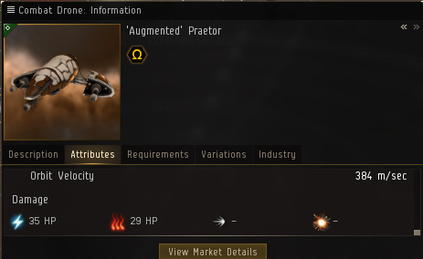

## 技能

一般来说，**船体技能加成高于通用技能加成**，如果已知需要**长期使用某艘船**，可优先学习船体技能，具体**根据自身情况规划**

### 装备

模拟装配左上角不能出现如图 _黄书_ 的标注，此说明装备**技能不够**。鼠标悬浮于上，可查看所需装备技能

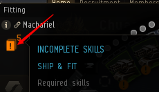

模拟装配右下角 CPU 、 栅格 不能出现红字，此说明你**工程学技能不够**，**无法开启所有装备**。

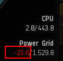

`CPU管理学` 可提升舰船 CPU 输出

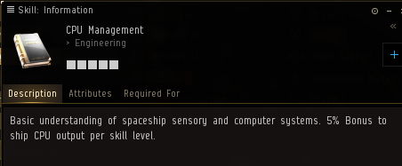

`能量栅格管理学` 可提升舰船栅格输出

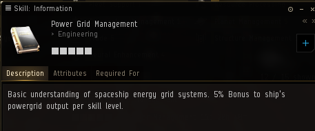

`武器升级研究` 和`高级武器升级研究`可降低炮台，导弹发射器栅格需求

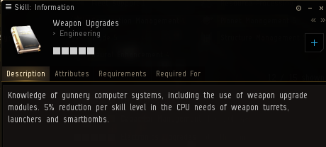

### 电量

如图所指位置如果为红字，说明装备全开的情况下，无法永动。

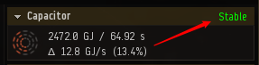

`电容管理学` 可提升舰船电容容量

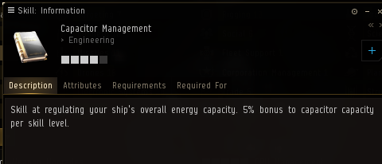

`电容系统操作`可提升电容恢复速度

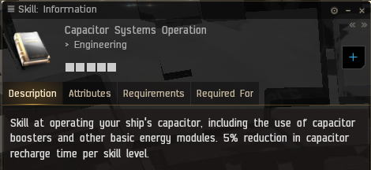

`燃料节约技术` 可减少加力的电容需求量

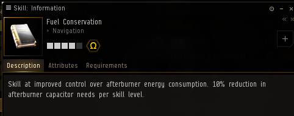

`加力燃烧器原理` 可减少加力的电容使用量

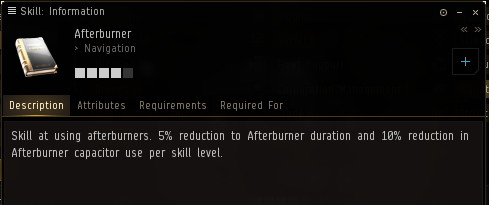

### 无人机

对应的 `无人机操控理论` 可提升所有此类无人机 DPS。Ⅴ 级可解锁`T2`和`加强型`

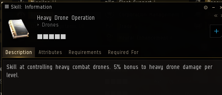

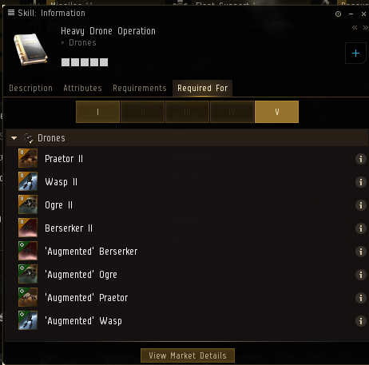

帝国`无人机专业研究`可提升对应帝国的各类无人机 DPS，仅对`T2`和`加强型`有加成

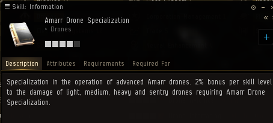

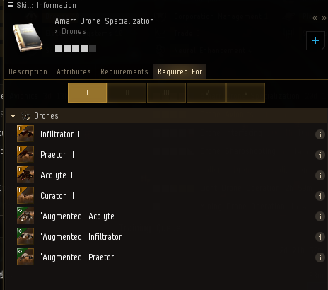

`无人机控制理论` 可提升所有无人机的 DPS

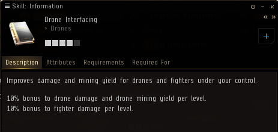

`无人机精准射击` 可提升无人机射击最佳范围，以提升无人机命中率

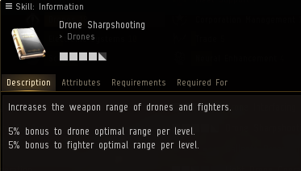

`无人机导航学` 可提升无人机的速度，以减少飞行时间

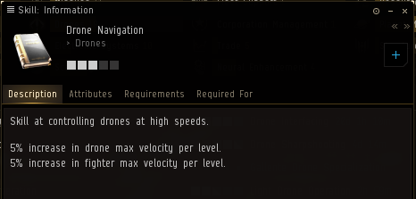

`无人机电子理论` 和 `高级无人机电子理论` 可增加无人机的操控范围,建议至少在 70km 以上

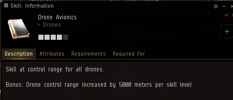

- 如果范围不够,可装配搞糟装备 `无人机链接增效器`

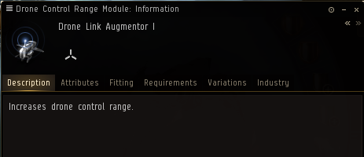

## 异常类型

无人机异常主要为:小队、巡逻队、群

难度为：群 &gt; 巡逻队 &gt; 小队，收益亦如

其中巡逻队与小队又有**有/无弹窗**之分，难度：无弹窗 &gt; 有弹窗，总收益亦如，但每跳赏金相当

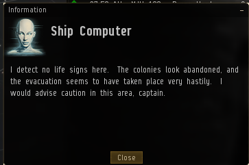

以上异常**均会出 10/10**，即异常结束时弹出的弹窗。因小队刷的较快，因此出的频率较高，**但几率是一样的**

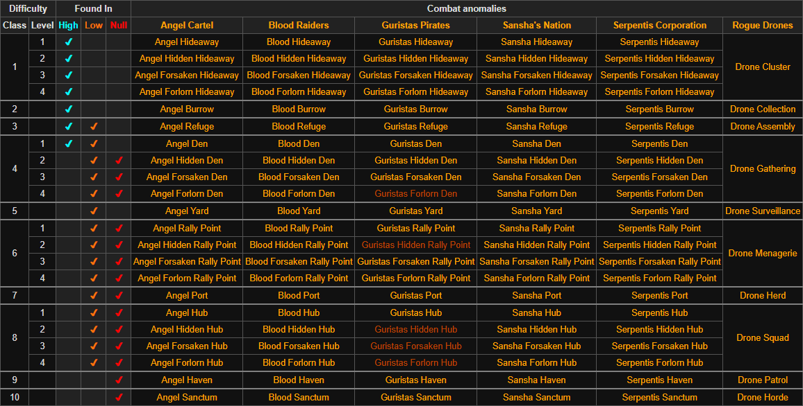

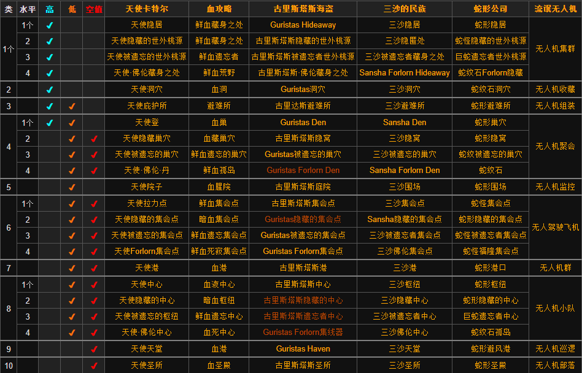

## 刷怪

### 报点频道

军团 MOTD 中，进入`Winter Rat 报点` 频道

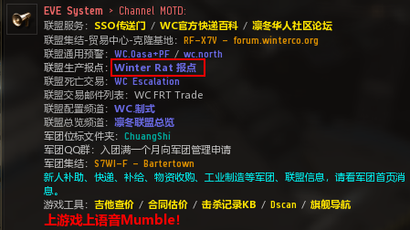

进入`Oasa Rat 报点` 频道

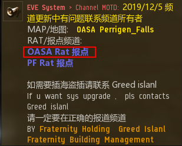

根据所在地进入相应的报点频道

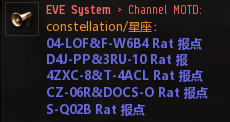

### 报点

如图操作打开扫描器，或快捷键 `alt + p`

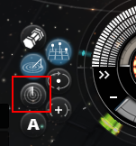

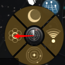

点击如图位置可单独弹出扫描器

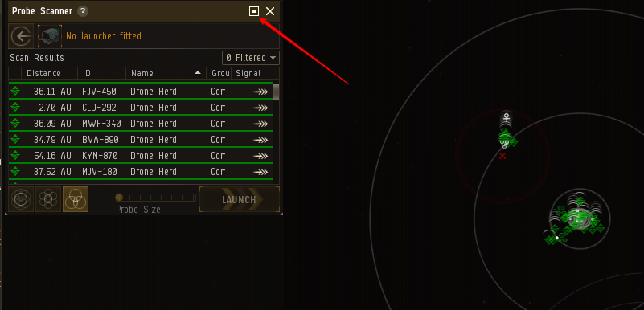

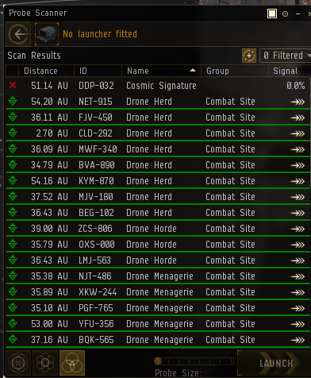

刷怪时，点击箭头后，立即停船，以判断目标是否为弹窗异常

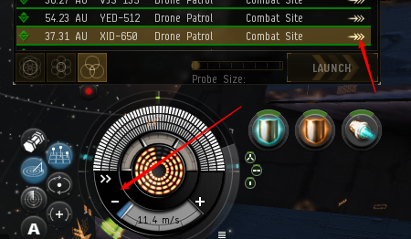

当决定要刷某异常时，将**异常编号的后三位数字发至报点频道**，可附带异常简称以帮助他人快速判断

| 异常   | 简称 |
| :----- | :--- |
| 巡逻队 | X    |
| 小队   | XD   |

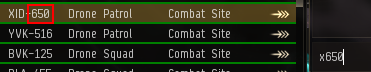

然后右键异常可选择落地距离

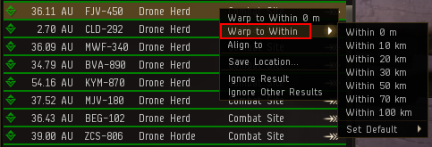

注意点（巡洋）：

- **第一时间清除电子战护卫怪！**

- **落地开推环绕建筑或残骸 30km**，速度需在 500m/s 以上

> 小队（弹窗）：跳 30km，环绕中间建筑
>
> 小队（无弹窗）：跳 0km，将其中**圆盘建筑打掉**，环绕残骸。注：**跳 20km 会卡在建筑中**
>
> 巡逻队（弹窗）：跳 30km，环绕中间建筑
>
> 巡逻队（无弹窗）：跳 50km，**落地往外拉**，同时放出无人机攻击中间 Key 怪，攻击后，立马召回无人机，会刷出**6 只护卫怪**，**第一时间清理**。清理后即可绕中间建筑环绕

## 规避

### 刷怪准备

1.安全生产：[https://wiki.chuangshiqingyu.com/pve/save](https://wiki.chuangshiqingyu.com/pve/save)

### 规避

本地进敌对后，进行如下操作：

1. **关闭推子**
2. 朝向建筑
3. 收无人机
4. 待无人机收回后，立马起跳
